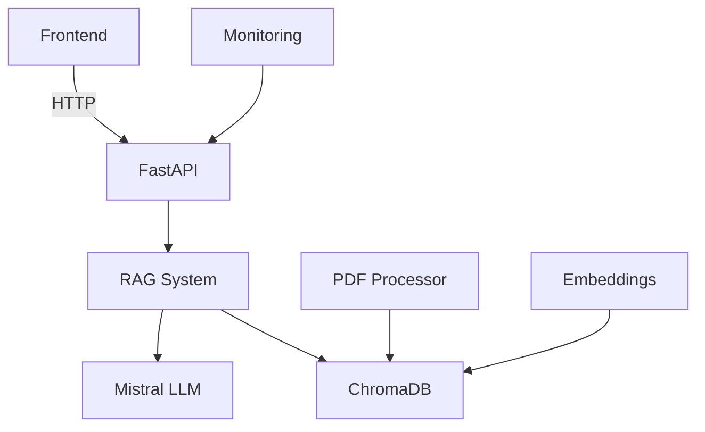

# 🧙‍♂️ Storybook AI - Harry Potter Knowledge Assistant

[](https://storybookharry.netlify.app)  


Link - https://storybookharry.netlify.app/
## 🌟 Features

- **Book-Specific Knowledge**: Answers from HP Books 1-4 only
- **Dual Response Modes**: 
  - 🎩 Freeform (storytelling style)
  - 📚 Structured (organized bullet points)
- **Chapter Summarization**: Characters, Events, Spells
- **Contextual Memory**: Remembers conversation history
- **Streaming Responses**: Real-time answer generation
- **Source Citations**: Shows book/chapter references

## 🏰 High-Level Architecture



## 🚀 User Journey

**1.** User asks question about HP universe  
**2.** System checks books 1-4 knowledge  
**3.** RAG finds relevant text passages  
**4.** LLM generates contextual response  
**5.** Response streamed back with sources  
**6.** Conversation history maintained  

## 🔧 Backend Magic

### Request Processing Flow

1. Request received via API endpoint
2. Auth/validation checks
3. Query enhancement with conversation history
4. Vector similarity search in ChromaDB
5. Context-aware LLM generation
6. Response formatting & streaming
7. Metrics collection & monitoring

### Key Components

| Component | Tech Stack | Purpose |
|-----------|------------|---------|
| API Layer | FastAPI, Uvicorn | Request handling |
| RAG Engine | LangChain, ChromaDB | Context retrieval |
| LLM | Mistral-7B | Response generation |
| Embeddings | all-MiniLM-L6-v2 | Text vectorization |
| Monitoring | Prometheus, Grafana | Performance tracking |

## 📡 API Endpoints

| Endpoint | Method | Description |
|----------|--------|-------------|
| /chat | POST | Main chat interface |
| /summarize | POST | Generate summaries |
| /health | GET | System status check |
| /clear-memory | GET | Reset conversation |
| /metrics | GET | Prometheus metrics |

## 🎨 Frontend Design

### Dual-Pane Interface

* **Left**: Chat Interface (Messages + Input)
* **Right**: Summary Generator (Dropdowns + Display)

### Theming System

* Light/Dark mode toggle
* Hogwarts House Themes:
  * 🦁 Gryffindor (Red/Gold)
  * 🐍 Slytherin (Green/Silver)
  * 🦡 Hufflepuff (Yellow/Black)
  * 🦅 Ravenclaw (Blue/Bronze)
* Freeform/Structure mode toggle
  

### Key React Components

* Streaming response handler
* Source citation parser
* Dynamic theme switcher
* Summary typeahead search

## 🛠️ Local Setup Guide

### Prerequisites

* Python 3.10+
* Node.js 16+
* Mistral API Key
* 8GB+ RAM recommended

### 1. Clone Repository

```bash
git clone https://github.com/yourusername/storybook-ai.git
cd storybook-ai
```

### 2. Install Dependencies

**Backend**
```bash
cd backend
pip install -r requirements.txt
```

**Frontend**
```bash
cd frontend
npm install
```

### 3. Configure Environment

Create .env file:
```ini
MISTRAL_API_KEY=your_api_key_here
DEBUG=True
CHROMA_DB_DIR=./data/processed/chroma_db
```

### 4. Prepare Data

* Place HP PDFs in data/Pdfs/
* Process books:
```bash
python process_books.py
python create_embeddings.py
```

### 5. Run Services

**Backend**
```bash
uvicorn main:app --reload
```

**Frontend**
```bash
npm start
```

## 🧠 Knowledge Processing Pipeline

1. PDF Text Extraction
2. Chapter Segmentation
3. Text Cleaning/Normalization
4. Chunking (512 tokens)
5. Embedding Generation
6. Vector Storage (ChromaDB)

## ⚡ Performance Tips

* Use DEBUG=False in production
* Enable response caching
* Limit conversation history length
* Use smaller embedding model
* Implement rate limiting

## 🚨 Troubleshooting

### Common Issues

* **Vector Store Not Found:**
  * Verify ChromaDB path
  * Re-run embedding creation

* **API Errors:**
  * Check Mistral API key
  * Validate CORS settings

* **Incomplete Responses:**
  * Increase MAX_NEW_TOKENS
  * Check streaming implementation

## 📚 Learning Resources

* [LangChain Docs](https://python.langchain.com/docs/get_started/introduction.html)
* [Mistral API Guide](https://docs.mistral.ai/)
* [FastAPI Best Practices](https://fastapi.tiangolo.com/tutorial/)
* [React Streaming Patterns](https://react.dev/blog/2022/03/29/react-18)

## 🤝 Contribution Guidelines

1. Fork repository
2. Create feature branch
3. Submit PR with:
   * Code changes
   * Updated tests
   * Documentation updates
   * Version bump

---

*Magical Note: This project respects J.K. Rowling's copyrights - uses only book text analysis, no reproduction of full content.*
